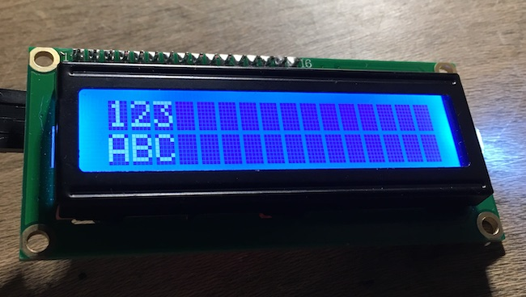

## Character

Go driver for the Hitachi HD44780U LCD character display. Tested with the Raspberry Pi.

See https://www.sparkfun.com/datasheets/LCD/HD44780.pdf for more details.



### Usage

```go
package main

import (
	"fmt"
	"os"
	"time"

	"github.com/a-h/character"
	"periph.io/x/periph/conn/i2c"
	"periph.io/x/periph/conn/i2c/i2creg"
	"periph.io/x/periph/host"
)

func main() {
	// Use the periph library.
	_, err := host.Init()
	if err != nil {
		fmt.Printf("err: %v\n", err)
		os.Exit(1)
	}

	// Open up first i2c channel.
	// You'll need to enable i2c for your Raspberry Pi in
	// https://www.raspberrypi.org/documentation/configuration/raspi-config.md
	bus, err := i2creg.Open("")
	if err != nil {
		fmt.Printf("err: %v\n", err)
		os.Exit(1)
	}

	// The default address for the i2c backpack is 0x27.
	dev := &i2c.Dev{
		Bus:  bus,
		Addr: 0x27,
	}

	// Create a 2 line display.
	d := character.NewDisplay(dev, false)

	// Scroll left and right.
	d.Print("ABCDEFGHIJKLMNOPQRSTUVWXYZ")
	for i := 0; i < 5; i++ {
		time.Sleep(time.Millisecond * 1000)
		d.DisplayShiftLeft()
	}
	for i := 0; i < 5; i++ {
		time.Sleep(time.Millisecond * 1000)
		d.DisplayShiftRight()
	}

	// Print on multople lines.
	d.Clear()
	d.Print("Line 1 contents")
	d.Goto(1, 0)
	d.Print("Line 2 contents")
	time.Sleep(time.Millisecond * 2000)

	// Animate entry manually.
	d.Clear()
	d.Goto(0, 0)
	d.Print("1")
	time.Sleep(time.Millisecond * 250)
	d.Goto(0, 1)
	d.Print("2")
	time.Sleep(time.Millisecond * 250)
	d.Goto(0, 2)
	d.Print("3")
	time.Sleep(time.Millisecond * 250)
	d.Goto(1, 2)
	d.Print("C")
	time.Sleep(time.Millisecond * 250)
	d.Goto(1, 1)
	d.Print("B")
	time.Sleep(time.Millisecond * 250)
	d.Goto(1, 0)
	d.Print("A")
}
```
